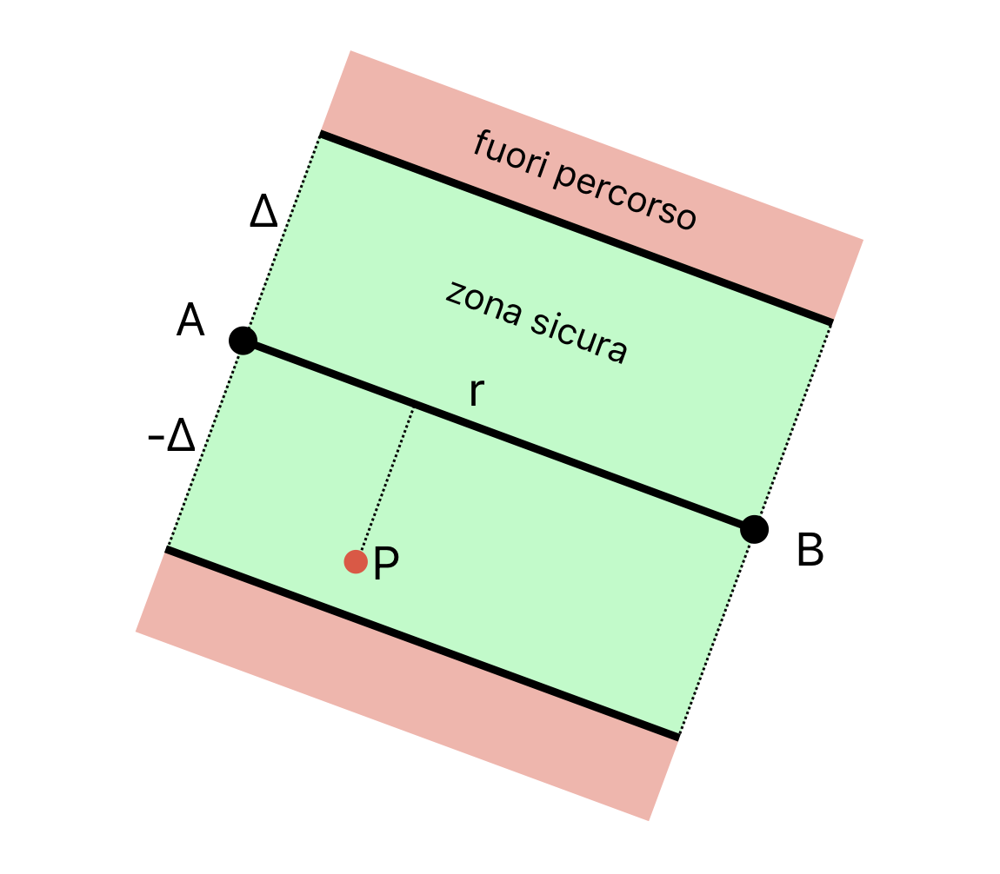
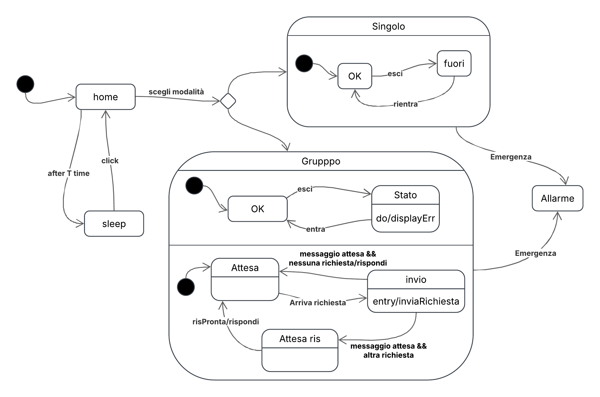
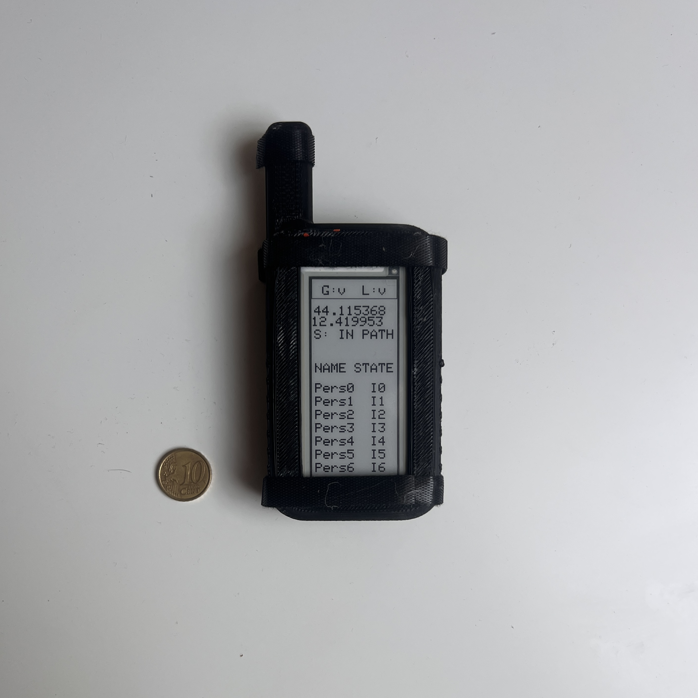
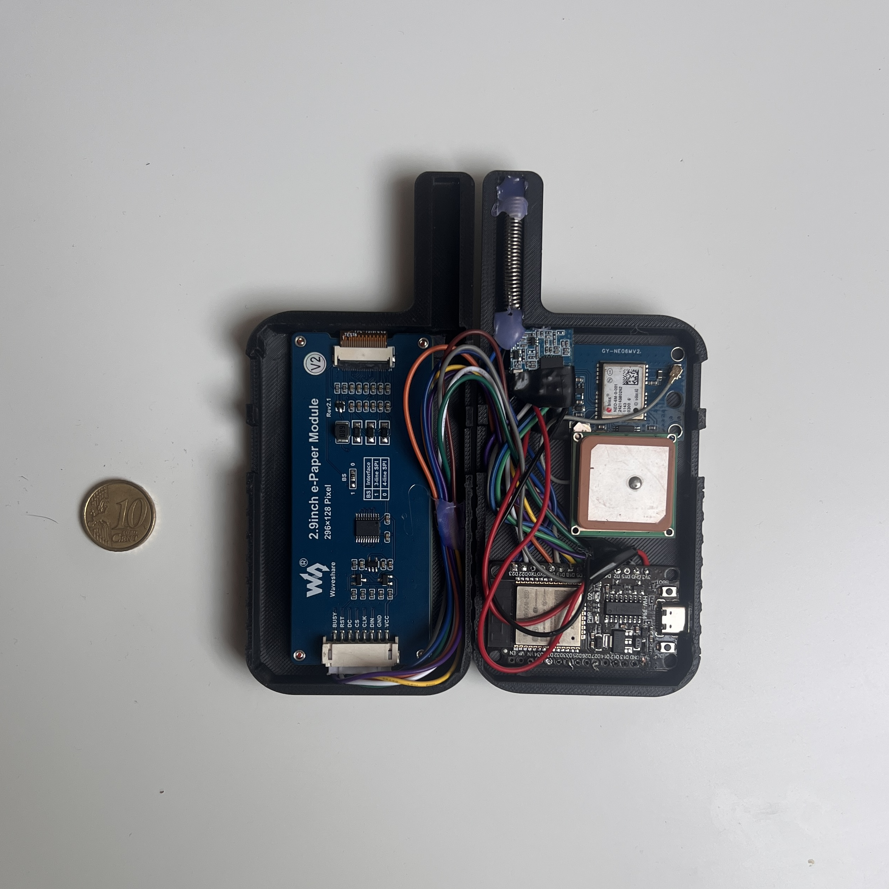

# HEARD Project — Comprehensive Description

**Full title:** Design and Development of Embedded Devices for the Safety of Hiking Groups in Remote Environments: The "HEARD" Project

**Author:** Lucio Baiocchi  
**University:** Alma Mater Studiorum – University of Bologna, Cesena Campus  
**Degree:** Bachelor's in Computer Engineering and Computer Science  
**Course:** Embedded Systems and Internet-of-Things  
**Supervisor:** Prof. Alessandro Ricci  
**Academic year:** 2024–2025

---

## 1. Motivation and Problem Statement

The project originates from the author's personal experience as a hiker and scout. Mountain environments present unique dangers: sudden weather changes, lack of cellular coverage, complex terrain. Existing safety tools are all designed for individual use — PLBs, GPS locators with SOS, radio transceivers, satellite phones — none of them support **group coordination** or **proactive prevention**.

The key gap identified:
- No tool lets group members share positions and status automatically without internet.
- Communication requires manual action; it does not occur automatically.
- "Mountain 4.0" is lagging behind Industry 4.0 in IoT, AI, and connectivity adoption.

---

## 2. The HEARD System

**HEARD** = *Hiking Emergency Assistance and Rescue Device*

Three pillars:
1. **Monitoring and Prevention** — detect dangerous situations and maintain group cohesion.
2. **Emergency Management** — send alarm signals with accurate localization.
3. **Simplicity and Robustness** — usable with gloves or in rain; operable without internet.

### 2.1 Three Device Variants

| Device | Target user | Key features |
|---|---|---|
| **Heard Core** (`core`) | Experienced hiker / mountain guide | Largest battery, e-ink display, physical buttons, SOS button under protective cap, route recording and group coordination |
| **Heard Node** (`node`) | Adult hiker | Smaller battery/display, follows pre-recorded routes, relays messages, sends/receives help requests — **firmware not yet implemented** (see [#1](https://github.com/luciobaiocchi/heard/issues/1)) |
| **Heard Pico** | Child / beginner | Button-sized, minimal UI: SEND = distress signal, RECEIVE = alert/weather notification |


### 2.2 Actors and Use Cases

Three user roles: **Guide**, **Adult**, **Child** — each maps to a device type.

Key use cases:
- **Update group**: periodic position/status sharing.
- **Coordinate group**: guide sets update intervals and acts as communication leader.
- **View position**: user sees their own GPS position and whether they are in/out of route.
- **SOS / distress signal**: immediate broadcast to all reachable devices.

---

## 3. System Constraints

Operating in mountain environments requires respecting strict constraints:
- **No internet**: system must work fully offline.
- **Limited power**: no reliable power source; battery life is critical.
- **Limited compute/memory**: runs on microcontrollers with ~350 KB heap.
- **Compact size**: must not hinder hiking.
- **Adverse conditions**: rain, gloves, sunlight, shocks, humidity.
- **Data security**: transmitted positions are sensitive.
- **Ease of use**: immediate, one-handed interaction.

---

## 4. Hardware

Both prototypes use the same hardware stack:

| Component | Model | Interface | Notes |
|---|---|---|---|
| Microcontroller | **ESP32** (Espressif) | — | Dual-core 240 MHz, 32-bit; Wi-Fi + BT; FreeRTOS support |
| GPS | **GY-NEO6MV2** (u-blox NEO-6M) | UART (RX=16, TX=17) | 1 Hz, lat/lon/alt/speed; patch antenna + backup battery |
| LoRa radio | **XL1278-SMT** | SPI (HSPI: SCK=18, MISO=19, MOSI=23, CS=5) | 433 MHz; up to 10 km open field; low power |
| Display | **2.9" e-ink** (GxEPD2_290_T94_V2) | SPI (VSPI: SCK=18, MOSI=23, CS=21, DC=2, RST=22, BUSY=4) | No backlight; readable in sunlight; retains image without power |



---

## 5. Software Architecture

### 5.1 Framework and OS

- **PlatformIO IDE** in VS Code — manages build, deps, upload.
- **FreeRTOS** — real-time OS for concurrent tasks on ESP32 dual cores.
- Language: **C++17** (Arduino framework).

### 5.2 Key Libraries

```ini
lib_deps =
    mikalhart/TinyGPSPlus@^1.1.0
    sandeepmistry/LoRa@^0.8.0
    adafruit/Adafruit SSD1306@^2.5.9
    adafruit/Adafruit GFX Library@^1.11.9
    zinggjm/GxEPD2@^1.5.2
    adafruit/Adafruit BusIO@^1.16.1
    https://github.com/ETLCPP/etl.git
```

### 5.3 Architecture Overview

The system is split into two independent subsystems:

```
┌──────────────────────┐    ┌──────────────────────────┐
│   PATH SUBSYSTEM     │    │   GROUP SUBSYSTEM        │
│                      │    │                          │
│  StateManager        │    │  ConnectionManager       │
│   ├─ Path            │    │   ├─ Connection (LoRa)   │
│   │   └─ LinkedList  │    │   ├─ pendingDevices      │
│   ├─ Gps             │    │   └─ knownPositions      │
│   └─ State           │    │  Group                   │
│       (IN_PATH /     │    │   └─ Person[]            │
│        OUT_PATH /    │    │                          │
│        NO_DATA)      │    │                          │
└──────────┬───────────┘    └────────────┬─────────────┘
           │                             │
           └──────────┐    ┌─────────────┘
                      ▼    ▼
                  SharedData  (thread-safe, mutex-protected)
                   ├─ GeoPoint position
                   └─ State state
```

**Thread safety**: `SharedData`, `ConnectionManager` positions and state are protected by FreeRTOS mutexes (`SemaphoreHandle_t`).

### 5.4 FreeRTOS Tasks

| Task | Core | Priority | Stack | Responsibility |
|---|---|---|---|---|
| `ConnectionManager` (internal task) | Core 0 | 2 | 8 KB | LoRa send/receive loop, position requests every 60 s |
| `TaskGPS` | Core 1 | 3 | 8 KB | GPS polling, state update via StateManager, feeds position to ConnectionManager |
| `TaskLoRa` | Core 0 | 1 | 4 KB | Monitors ConnectionManager state (legacy / monitoring) |
| `TaskStatus` | Core 1 | 0 | 4 KB | Debug serial output every 10 s |


---

## 6. Path / Route Subsystem

### 6.1 Path Loading

Routes are stored as `.gpx` files. A **Python script** (`path_loader/path_loader.py`) parses the GPX and sends lat/lon pairs over serial at 115200 baud. The device reads them via `StateManager::loadPath()` until it receives `"END"`.

Each route point is stored in a **doubly-linked list** (`LinkedList`) of `Point` objects. A k-d tree was considered but rejected — the linked list proved efficient enough even for paths with 3000+ points, and it uses less memory.

Memory estimate: 8 bytes/point × 3000 points = 24 KB (< 7% of 350 KB heap).

### 6.2 Off-Route Detection Algorithm

The device state is one of: `IN_PATH`, `OUT_PATH`, `NO_DATA`.

**Algorithm** (in `Path::isInsidePath(Point p)`):
1. Find nearest route point `V` using `findNearestPoint()`.
2. If `haversineDistance(P, V) ≤ maxDistance` → **IN_PATH**.
3. Otherwise check distance from P to segment `V–prev` and `V–next`.
4. If either ≤ maxDistance → **IN_PATH**, else → **OUT_PATH**.

Default `maxDistance = 100 meters`.

### 6.3 Distance Formulas

**Point-to-point (Haversine formula)** — accounts for Earth's curvature:

```
a = sin²(Δφ/2) + cos(φ₁)·cos(φ₂)·sin²(Δλ/2)
c = 2·atan2(√a, √(1−a))
d = R·c    (R ≈ 6,371,000 m)
```

**Point-to-segment (equirectangular projection)** — used for segment distance:
- Projects geographic coords onto a local Cartesian plane.
- Error ~10–20% for distant points, acceptable for the ≤100 m detection zone.

### 6.4 Testing Results

| Test | Result |
|---|---|
| Path deviation detection error | ~0.5 m average with 100 m max zone (< 1%) |
| GPS positioning error | ~1 m max (due to `float` precision trade-off for memory) |

**Note:** Coordinates stored as `float` instead of `double` — deliberate trade-off: ~1 m position error in exchange for significant memory savings.

---

## 7. Group / Communication Subsystem

### 7.1 LoRa Protocol

Three message types:

| Type | Format | Meaning |
|---|---|---|
| `REQ` | `REQ\|hopList\|knownPositions` | Master broadcasts position request |
| `WAIT` | `WAIT\|deviceId` | Intermediate node tells master it is gathering responses |
| `POS` | `POS\|id,lat,lng\|id,lat,lng\|...` | Device sends back position data |

### 7.2 Basic Communication Mode

Heard Core periodically broadcasts a `REQ` message to all reachable devices. Each device responds with its `POS`. Simple but limited to direct LoRa range.

### 7.3 Network Communication (Modified Selective Flooding)

Extends range by using intermediate Nodes as relays:

1. Master `M` broadcasts `REQ|[M]|knownPositions`.
2. Each receiving node appends its ID to the hop list and forwards: `REQ|[M,1]|...`
3. When `M` receives a request from node `1`, it knows `1` is gathering data downstream → adds `1` to `pendingDevices`, sends `WAIT|M` to `1`.
4. Node `1` collects responses from its reachable peers, then sends aggregated `POS` data back upstream to `M`.
5. `M` resets timeout on each `WAIT` received.
6. Round ends when `pendingDevices` and `waitingDevices` are both empty.

`WAIT` messages prevent premature replies, avoid synchronization errors, and let `M` detect unreachable nodes (timeout).

Auto-request interval: **60 seconds**. Global timeout: **30 s**. Per-device timeout: **10 s**.



### 7.4 ConnectionManager Architecture

```
ConnectionManager
 ├─ knownPositions: map<int, DevicePosition>   // thread-safe via positionMutex
 ├─ pendingDevices: vector<PendingDevice>       // waiting for response
 ├─ waitingDevices: set<int>                   // known to be relaying
 ├─ requestInProgress: bool                    // thread-safe via stateMutex
 └─ Connection* (LoRa hardware abstraction)
```

`getKnownPositions()` is the public interface used by `TaskGPS` to update the master's own position and by the display to show group status.

### 7.5 Testing Results

| Test | Result |
|---|---|
| LoRa range (open field) | ~3 km with stable reception |
| LoRa range (buildings, no line-of-sight) | ~300–400 m |
| Transmission speed | Near-instantaneous |
| Error rate (open field) | ~0.5% |
| Error rate (buildings) | 4–10% |

---

## 8. Display (e-Ink)

Class: `DisplayEInk` wrapping `GxEPD2_290_T94_V2`.

Screens:
- **Loading screen** (`drawLoadingScreen`)
- **Main screen** (`drawMainScreen`) — shown while waiting for path load
- **Received points screen** (`drawReceivedPoints`) — confirms GPX load, shows point count and path length
- **Activity screen** (`loadActivityScreen`) — main operational UI:
  - Header: LoRa status, GPS status
  - User data row: own GPS position + state (IN_PATH / OUT_PATH / NO_DATA)
  - Table: up to 7 rows for group members (name + state)

Layout constants: headerH=30px, userH=80px, rowH=20px, tableRows=7.

---

## 9. Physical Prototype

- **3D-printed casing** — custom designed; files in `3d_models/`.
- Components soldered directly to minimize space.
- Size reference: compared to a 10-cent coin in the thesis photos.




---

## 10. Path Loader Tool

Located in `code/path_loader/`. Python scripts for preparing and uploading routes:

| File | Purpose |
|---|---|
| `path_loader.py` | Parses `.gpx`, sends lat/lon pairs via serial, estimates memory usage |
| `path_cleaner.py` | Cleans/simplifies a GPX file |
| `simulation.py` | Simulates device behavior |
| `output_cleaned.gpx` | Example cleaned GPX |
| `activity_*.gpx` | Sample Garmin activity files |

Setup:
```bash
python3 -m venv venv
source venv/bin/activate
pip install pyserial matplotlib numpy
```

---

## 11. Future Extensions

1. **Custom PCB** — replace breadboard prototype; reduce size; consider Raspberry Pi Zero W.
2. **Strategic servers** — low-power servers near trail heads with internet; act as additional LoRa nodes; provide weather data.
3. **AI "guardian angel"** — server-side AI monitors hiker positions + weather + risk levels per path segment; triggers proactive warnings.
4. **Mobile app** ("Heard") — already partially developed; shows group positions on local maps, shares completed routes.
5. **Path sensors** — solar-powered sensors along trail for more precise localization in GPS-weak areas (dense forest).
6. **Energy-saving mode** — adaptive update frequency; disable GPS/display when idle; predictive battery management.

---

## 12. Project File Structure

```
thesis/
├── HEARD_PROJECT.md                    ← this file
├── Design_and_development_...pdf       ← thesis document
├── images/                             ← extracted PDF images (img-000 to img-047)
├── 3d_models/                          ← STL files for physical casing
└── code/
    ├── core/              ← Heard Core firmware (ESP32, PlatformIO)
    │   ├── src/
    │   │   ├── main_m.cpp              ← entry point, FreeRTOS task setup
    │   │   ├── SharedData.cpp
    │   │   ├── display/DisplayEInk.cpp
    │   │   ├── group/
    │   │   │   ├── Connection.cpp      ← LoRa send/receive abstraction
    │   │   │   ├── ConnectionManager.cpp
    │   │   │   ├── Group.cpp
    │   │   │   └── Person.cpp
    │   │   └── path/
    │   │       ├── StateManager.cpp    ← top-level path logic, loads GPX
    │   │       ├── Path.cpp            ← isInsidePath, distance algorithms
    │   │       ├── Gps.cpp             ← TinyGPSPlus wrapper
    │   │       ├── GeoPoint.cpp
    │   │       ├── LinkedList.cpp
    │   │       └── Point.cpp           ← haversineDistanceTo, equirectangular
    │   ├── include/                    ← header files (mirrors src structure)
    │   ├── data/percorso.gpx           ← sample route
    │   └── platformio.ini
    ├── node/             ← Heard Node firmware — NOT yet implemented (only a basic LoRa receiver sketch, see #1)
    │   └── src/main_f.cpp
    └── path_loader/                    ← Python tools for loading routes
        ├── path_loader.py
        ├── path_cleaner.py
        └── simulation.py
```

---

## 13. Key Design Decisions

| Decision | Rationale |
|---|---|
| `float` over `double` for coordinates | Saves memory; acceptable ~1 m position error |
| LinkedList over k-d tree for path | Simpler, lower memory; O(n) scan acceptable for ≤3000 points |
| e-ink display | No backlight = readable in sunlight; retains image without power |
| 433 MHz LoRa | Long range (up to 10 km), low power, no infrastructure needed |
| FreeRTOS dual-core task split | Path task on Core 1, LoRa/ConnectionManager on Core 0 — avoids interference |
| Equirectangular projection for segment distance | Balance between accuracy and computational cost on embedded hardware |
| WAIT messages in protocol | Prevent premature replies; let master detect unresponsive nodes via timeout |
| Doubly-linked list for path | Allows checking both prev and next segments from nearest point |
