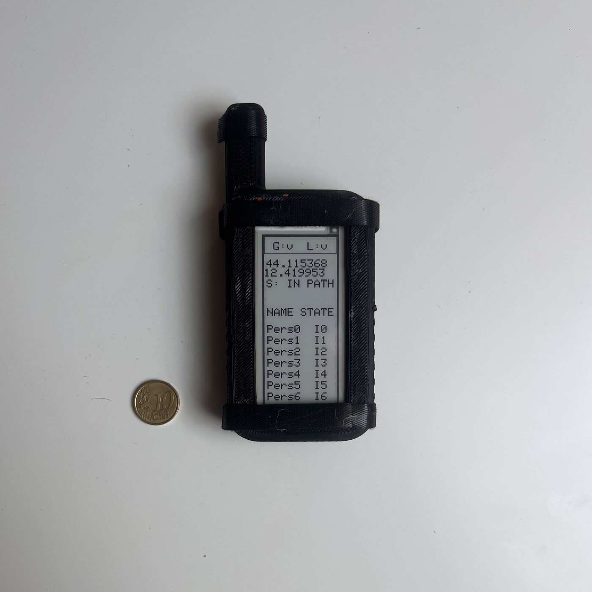
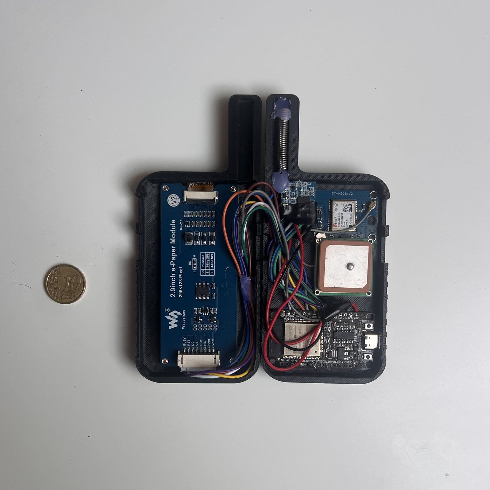
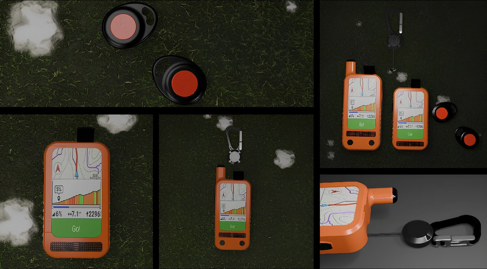
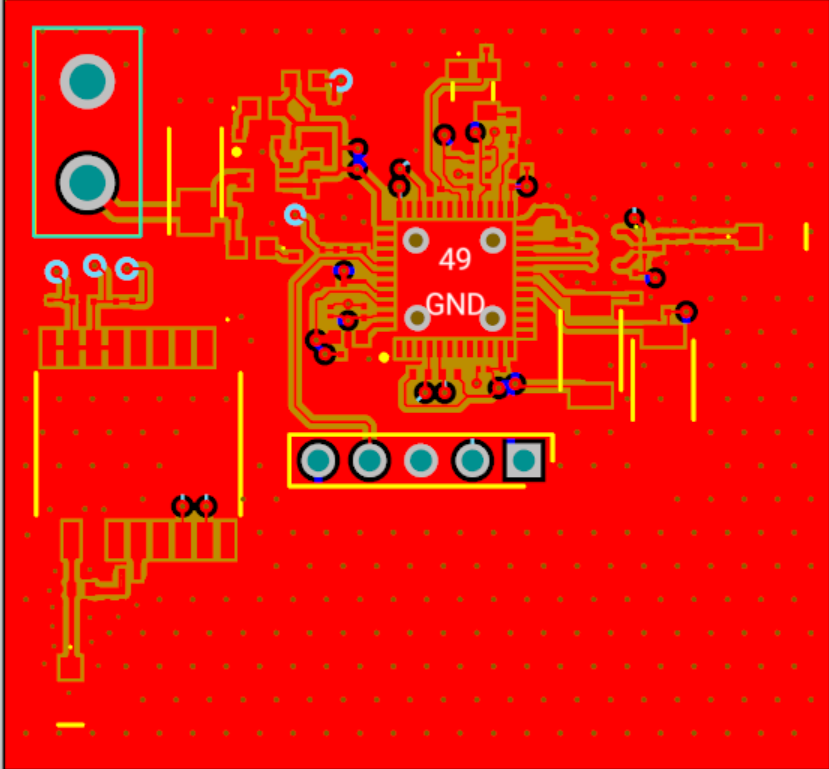
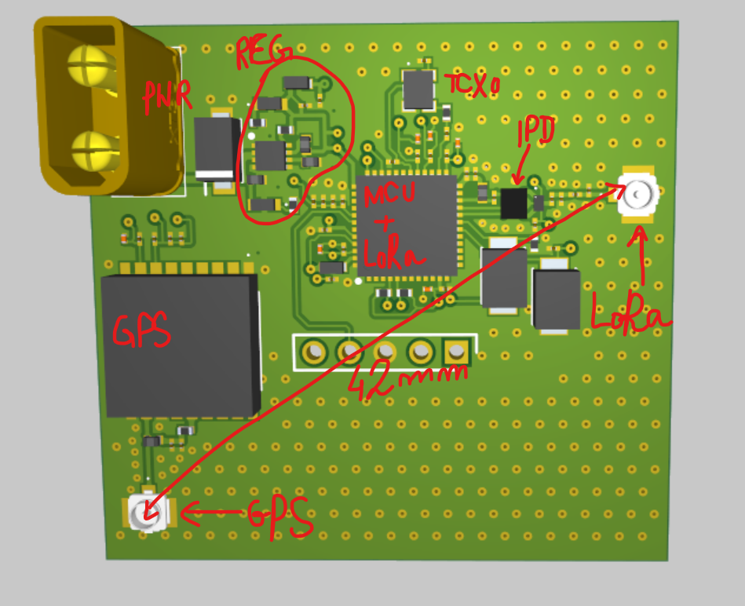

<p align="center">
  
</p>

<h1 align="center">HEARD — Hiking Emergency Assistance and Rescue Device</h1>

<p align="center">
  <a href="https://github.com/luciobaiocchi/heard/actions/workflows/ci.yml"></a>
  <a href="LICENSE"></a>
  <a href="https://www.youtube.com/watch?v=rSgT1LedNBk"></a>
</p>

**Embedded devices for the safety of hiking groups in remote environments — fully offline, over LoRa.**

Born as a Bachelor's thesis in Computer Engineering and Computer Science — Alma Mater Studiorum · University of Bologna (Cesena Campus), AY 2024–2025.
Author: **Lucio Baiocchi** · Supervisor: **Prof. Alessandro Ricci**

📺 *Build video: the whole creation process is documented on [YouTube](https://www.youtube.com/watch?v=rSgT1LedNBk).*

<p align="center">
  
  
</p>
<p align="center"><em>The Heard Core prototype: live group status on e-ink (left) and the internals — ESP32, GPS, LoRa, e-ink (right). 10-cent coin for scale.</em></p>

---

## The problem

In remote mountain areas there is no cellular coverage, and existing safety tools (PLBs, satellite messengers, GPS locators) are individual-use only: they can call for help *after* an accident, but they don't help a **group** stay together and prevent one. HEARD is a small mesh of ESP32 devices that lets a group leader know, in real time and with zero infrastructure, **where everyone is** and **whether anyone left the planned route**.

## How it works

- Every hiker carries a device with **GPS** and a **LoRa radio**.
- The planned route (GPX) is loaded onto each device; an onboard algorithm continuously classifies the hiker as `IN_PATH` / `OUT_PATH` against a configurable corridor (default ±100 m).
- The group leader's device (**Core**) periodically polls the group over LoRa. Out-of-range members are reached via **multi-hop relaying** through the other devices (selective flooding with hop lists).
- Everything runs offline on the devices themselves: no phone, no internet, no SIM.

### Device variants

| Device                                | User                      | Role                                                           |
| ------------------------------------- | ------------------------- | -------------------------------------------------------------- |
| **Heard Core** (`core`)  | Guide / experienced hiker | E-ink display, SOS button, route recording, group coordination |
| **Heard Node** (`node`) | Adult hiker               | Follows the route, answers polls, relays messages — **firmware not yet implemented** ([#1](https://github.com/luciobaiocchi/heard/issues/1)) |
| **Heard Pico** (concept)              | Child / beginner          | Button-sized: send distress, receive alerts                    |

> **Prototype status:** the thesis goal was to build a **first working demo and the architecture behind it** — the protocol, the off-route detection and the firmware-in-the-loop simulator — not a finished product. The group protocol (`ConnectionManager`) is shared firmware code implementing **both roles**: device id 0 acts as the Core (initiates polling rounds), any other id acts as a Node (relays REQs, announces out-of-range members via WAIT, forwards POS reports toward the core). The simulator regression-tests this with all-real-firmware groups up to 3 hops deep. `node/` itself still contains only a minimal LoRa receiver sketch — a standalone Node build (shared protocol + GPS + path check, no display) is an open milestone ([#1](https://github.com/luciobaiocchi/heard/issues/1)), and more field testing and improvements are planned — issues and contributions are welcome.

### LoRa protocol (3 message types)

```
REQ|hopList|knownPositions   Core broadcasts a position request
WAIT|deviceId                an intermediate node signals it is relaying
POS|id,lat,lng|...           a device returns (aggregated) positions
```

WAIT messages keep the Core's timeout alive while distant nodes are being reached; duplicate relays are suppressed via hop-list fingerprints. Polling interval, global and per-device timeouts are configured in `code/core/include/config.h`.

## Simulator + 3D replay viewer

The repository includes a full **digital twin** of the system: the *actual firmware protocol code* (`ConnectionManager`) is compiled into a Python module via pybind11 and driven tick-by-tick along real GPX tracks, with a probabilistic LoRa channel (distance falloff + optional terrain line-of-sight using ITU-R P.526 knife-edge diffraction over real DEM tiles).

Recorded runs are replayed in the browser on **3D terrain** (MapLibre GL JS):


*Blue trail = planned route, green corridor = allowed deviation, dots = devices (red = Core), expanding rings = LoRa transmissions, sidebar = live protocol state, delivery metrics and group connectivity matrix.*

```bash
# 1. Build the simulation module (firmware C++ → Python)
cd code/simulator
pip install numpy matplotlib pybind11
cmake -B build -DPYTHON_EXECUTABLE=$(which python3) && cmake --build build
cp build/heard_sim*.so .

# 2. Record a run (real GPX, optional terrain obstruction, custom radio range)
python3 record.py --loops 1 --terrain --reliable 2000 --max-range 5000

# 3. Replay it in 3D
cd web && python3 -m http.server 8000   # → http://localhost:8000
```

See [`code/simulator/README.md`](code/simulator/README.md) for the full documentation.

## Repository layout

```
code/
├── core/    Heard Core firmware   (PlatformIO · ESP32 · FreeRTOS · C++17)
├── node/   Node LoRa receiver test sketch (see Prototype status above)
├── path_loader/          GPX tools: clean tracks, upload routes to devices over serial
└── simulator/            Digital twin: firmware-in-the-loop simulation
    ├── sim/              pybind11 shims wrapping the real ConnectionManager
    ├── mocks/            Arduino / FreeRTOS / LoRa mocks for host compilation
    └── web/              MapLibre 3D replay viewer (ES modules, no build step)
images/                   Figures
PCB V1/   Version 1 of the PCB design
├──EM SIMULATION FILES/   EM simulations of the RF sections of the PCB and their CST files
├──GERBER FILES/    GERBER outputs for the project
├──ODB++ FILES/   ODB++ outputs for the project
├──SCHEMATICS.pdf
├──HEARD_BOM.xlsx/  Detailed Bill of Materials with Vendor choises
HEARD_PROJECT.md          Comprehensive project description
```

## Hardware

ESP32 (dual-core, FreeRTOS) · u-blox NEO-6M GPS · LoRa transceiver · 2.9″ e-ink display (Core) · 3D-printed casing. Field tests measured ~1 m GPS error, <1% path-deviation error, LoRa range of ~3 km open / 300–400 m obstructed.

The 3D-printable enclosure files are available as a GitHub Release: **[Core enclosure v0.1](https://github.com/luciobaiocchi/heard/releases/tag/enclosure-v0.1)** — `core_front.stl` and `core_back.stl`, sized for a 2.9″ e-ink module.


*Product concept: Heard Core / Node handhelds and the button-sized Heard Pico for children.*

> **New Hardware** Since the on-board Radio is not being used we are trying to move away from the ESP architecture to an ARM based STM32 based architecture with LoRa builtin like the STM32WL series of chips along with their IPD.

<p align="center">
  
  
</p>
<p align="center"><em>The Heard PCB prototype: 2D view of the PCB (left) and 3D view of the same with key compoenents marked(right)</em></p>

## Hardware: PCB V1 (Alpha Release)

The first physical iteration (**V1**) of the HEARD tracker board is now complete, packing both long-range communication and high-accuracy positioning into a compact ultra-small form factor. We are inviting hardware engineers, radio enthusiasts, and makers to review the design, order test prints, and share their physical testing telemetry.

### 📡 Salient Hardware Features
* **Dimensions:** Ultra-compact 40.97 mm × 38.13 mm footprint.
* **Core Silicon:**
  * **MCU/LoRa:** STMicroelectronics `STM32WLE5CCU6` (System-on-Chip with integrated LoRa sub-GHz transceiver).
  * **GNSS/GPS:** u-blox `MAX-M10M-00B` featuring an integrated Low Noise Amplifier (LNA) and SAW filter for rapid, high-sensitivity positioning lock.
* **Passives:** Optimized for space; using mostly metric 0402 (imperial 01005) passives, with critical components scaling to imperial 0402 where required.

---

### 🎛️ Layer Stackup & RF Coplanar Waveguides
The board utilizes a standard **PCBWay 4-layer 1.6mm stackup** optimized for consistent 50Ω RF performance.

| Layer | Type | Material | Thickness | Dk (Dielectric Constant) |
|---|---|---|---|---|
| **Top** | Copper (Signal/RF) | 1 oz | 0.0175 mm | — |
| *Dielectric* | Prepreg (PP) | — | 0.1855 mm | 4.74 |
| **Inner 1** | Copper (GND Plane) | 1 oz | 0.0350 mm | — |
| *Dielectric* | Core | — | 1.0300 mm | 4.60 |
| **Inner 2** | Copper (GND Plane) | 1 oz | 0.0350 mm | — |
| *Dielectric* | Prepreg (PP) | — | 0.1855 mm | 4.74 |
| **Bottom** | Copper (Signal) | 1 oz | 0.0175 mm | — |

#### Controlled Impedance Profiles (Grounded Coplanar Waveguide)
All high-frequency RF sections have been tightly modeled for impedance continuity:
* **Single-Ended 50Ω (Antennas & IPD Output):** 11.578 mil trace width / 10.0 mil copper clearance gap.
* **Single-Ended 57Ω (IPD Input Match):** 8.962 mil trace width / 10.0 mil copper clearance gap.
* **Differential 100Ω (LoRa RX Diff Pair):** $Z_0$ = 61Ω, $Z_{\text{diff}}$ = 106Ω, $Z_{\text{even}}$ = 70Ω. Designed with 7.771 mil trace widths, a 7.987 mil intra-pair gap, and 10.0 mil copper clearance to ground.

---

> ⚠️ **RF Simulation Note:** Due to compute limitations, cross-talk/isolation simulations between the active LoRa and GPS front-ends have not yet been run simultaneously. If you have access to a heavy simulation cluster and want to contribute a coupled EM analysis, please reach out!

---

### 🛠️ Call to Action: Help Us Test V1!
We need real-world data. If you are looking to spin a high-performance tracking board, feel free to use these manufacturing files to order prototypes from your favorite fab. 

**How you can contribute:**
1. **Fab & Assemble:** Order the PCB using the ODB++ or Gerber data, source parts via the BOM, and build a prototype.
2. **RF Verification:** If you have access to a VNA (Vector Network Analyzer), verify our trace impedances and return loss against the `COMBED.pdf` baseline simulation.
3. **Firmware Integration:** Flash test routines to evaluate the u-blox MAX-M10M cold-start times alongside active LoRa transmissions.
4. **Give Feedback:** Open an Issue or Pull Request with your findings, assembly notes, or suggested layout changes for the upcoming V2 revision!

### PCB sponsor

<a href="https://www.pcbway.com/"></a>

[**PCBWay**](https://www.pcbway.com/) is supporting HEARD by sponsoring the manufacturing of the prototype PCBs. We're looking for a contributor to turn the breadboard schematic ([Wokwi project](https://wokwi.com/projects/436295484715573249)) into a manufacturable board — see the [PCB design milestone](ROADMAP.md#7-hardware-and-enclosure).

> **Disclosure:** PCBWay's sponsorship covers only the cost of producing the PCBs. It is **not** a monetary payment to the author, and no money changes hands. HEARD remains an independent, open-source project.

## Documentation

- [`HEARD_PROJECT.md`](HEARD_PROJECT.md) — comprehensive project description
- [`ROADMAP.md`](ROADMAP.md) — what's next: firmware milestones, simulator improvements, MeshCore/Meshtastic as transport
- [`code/simulator/README.md`](code/simulator/README.md) — simulator & viewer manual
- [`code/simulator/SIMULATION.md`](code/simulator/SIMULATION.md) — deep dive: how the simulation works and why every parameter has its value
- [`code/simulator/ARCHITECTURE.md`](code/simulator/ARCHITECTURE.md) — how the firmware is compiled into the simulator

## License

Licensed under the [Apache License 2.0](LICENSE).

> ⚠️ **Disclaimer**: HEARD is a research prototype, not a certified safety device. Do not rely on it as your only emergency equipment in the field.
