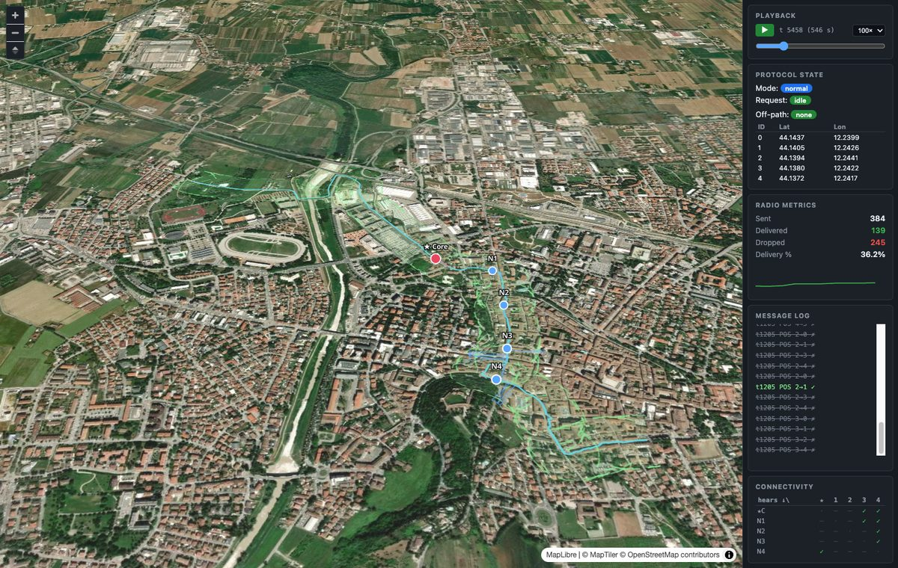

# HEARD — Hiking Emergency Assistance and Rescue Device

**Embedded devices for the safety of hiking groups in remote environments — fully offline, over LoRa.**

Born as a Bachelor's thesis in Computer Engineering and Computer Science — Alma Mater Studiorum · University of Bologna (Cesena Campus), AY 2024–2025.
Author: **Lucio Baiocchi** · Supervisor: **Prof. Alessandro Ricci**

📺 *Build video: the whole creation process is documented on YouTube — link coming soon.*

---

## The problem

In remote mountain areas there is no cellular coverage, and existing safety tools (PLBs, satellite messengers, GPS locators) are individual-use only: they can call for help *after* an accident, but they don't help a **group** stay together and prevent one. HEARD is a small mesh of ESP32 devices that lets a group leader know, in real time and with zero infrastructure, **where everyone is** and **whether anyone left the planned route**.

## How it works

- Every hiker carries a device with **GPS** and a **LoRa radio**.
- The planned route (GPX) is loaded onto each device; an onboard algorithm continuously classifies the hiker as `IN_PATH` / `OUT_PATH` against a configurable corridor (default ±100 m).
- The group leader's device (**Core**) periodically polls the group over LoRa. Out-of-range members are reached via **multi-hop relaying** through the other devices (selective flooding with hop lists).
- Everything runs offline on the devices themselves: no phone, no internet, no SIM.

### Device variants

| Device | User | Role |
|---|---|---|
| **Heard Core** (`dispositivo_madre`) | Guide / experienced hiker | E-ink display, SOS button, route recording, group coordination |
| **Heard Node** (`dispositivo_figlio`) | Adult hiker | Follows the route, answers polls, relays messages |
| **Heard Pico** (concept) | Child / beginner | Button-sized: send distress, receive alerts |

### LoRa protocol (3 message types)

```
REQ|hopList|knownPositions   Core broadcasts a position request
WAIT|deviceId                an intermediate node signals it is relaying
POS|id,lat,lng|...           a device returns (aggregated) positions
```

WAIT messages keep the Core's timeout alive while distant nodes are being reached; duplicate relays are suppressed via hop-list fingerprints. Polling interval, global and per-device timeouts are configured in `code/dispositivo_madre/include/config.h`.

## Simulator + 3D replay viewer

The repository includes a full **digital twin** of the system: the *actual firmware protocol code* (`ConnectionManager`) is compiled into a Python module via pybind11 and driven tick-by-tick along real GPX tracks, with a probabilistic LoRa channel (distance falloff + optional terrain line-of-sight using ITU-R P.526 knife-edge diffraction over real DEM tiles).

Recorded runs are replayed in the browser on **3D terrain** (MapLibre GL JS):



*Blue trail = planned route, green corridor = allowed deviation, dots = devices (red = Core), expanding rings = LoRa transmissions, sidebar = live protocol state, delivery metrics and group connectivity matrix.*

```bash
# 1. Build the simulation module (firmware C++ → Python)
cd code/simulator
pip install numpy matplotlib pybind11
cmake -B build -DPYTHON_EXECUTABLE=$(which python3) && cmake --build build
cp build/heard_sim*.so .

# 2. Record a run (real GPX, optional terrain obstruction, custom radio range)
python3 record.py --loops 1 --terrain --reliable 2000 --max-range 5000

# 3. Replay it in 3D
cd web && python3 -m http.server 8000   # → http://localhost:8000
```

See [`code/simulator/README.md`](code/simulator/README.md) for the full documentation.

## Repository layout

```
code/
├── dispositivo_madre/    Heard Core firmware   (PlatformIO · ESP32 · FreeRTOS · C++17)
├── dispositivo_figlio/   Heard Node firmware
├── path_loader/          GPX tools: clean tracks, upload routes to devices over serial
└── simulator/            Digital twin: firmware-in-the-loop simulation
    ├── sim/              pybind11 shims wrapping the real ConnectionManager
    ├── mocks/            Arduino / FreeRTOS / LoRa mocks for host compilation
    └── web/              MapLibre 3D replay viewer (ES modules, no build step)
images/                   Figures
HEARD_PROJECT.md          Comprehensive project description
```

## Hardware

ESP32 (dual-core, FreeRTOS) · u-blox NEO-6M GPS · LoRa transceiver · 2.9″ e-ink display (Core) · 3D-printed casing. Field tests measured ~1 m GPS error, <1% path-deviation error, LoRa range of ~3 km open / 300–400 m obstructed.

## Documentation

- [`HEARD_PROJECT.md`](HEARD_PROJECT.md) — comprehensive project description
- [`code/simulator/README.md`](code/simulator/README.md) — simulator & viewer manual
- [`code/simulator/ARCHITECTURE.md`](code/simulator/ARCHITECTURE.md) — how the firmware is compiled into the simulator

## License

Licensed under the [Apache License 2.0](LICENSE).

> ⚠️ **Disclaimer**: HEARD is a research prototype, not a certified safety device. Do not rely on it as your only emergency equipment in the field.
